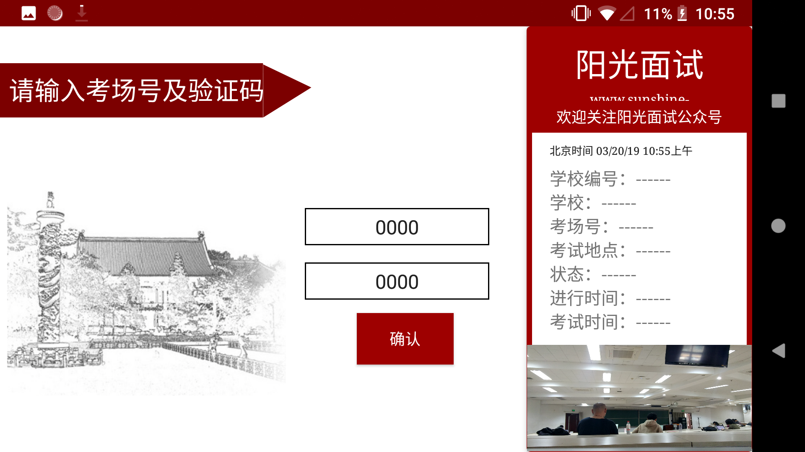
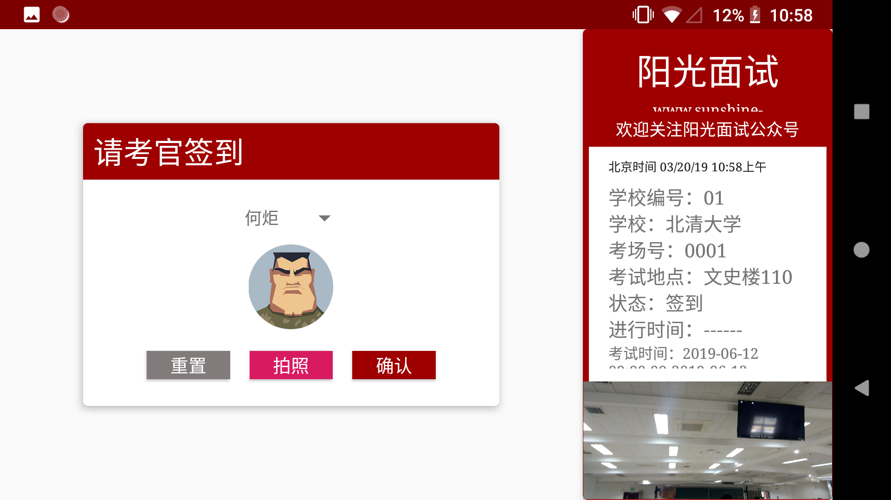

# Sunshine Interview

### What is Sunshine Interview?

Briefly it's a project aiming at promoting the transparency and openness of college enrollment interview based on *Blockchain* and other cutting-edge technologies. 

Before interview starts, interviewers and interviewees are both supposed to start the Android App, validate the interview site and sign in. As the interview starts, the App utilize the device’s front camera to act as a witnness. It keeps a stream of video, calculate the hash value and write the hash value on Blockchain in real time. 

As you may heard of before, Blockchain safeguards that **everything stored on it could not be tampered with**. Thus if someone argues that one interview were fishy, parties involved can download the video, **validate the genuineness of it and re-judge the performance of interviewees**. 

### Demo

### Emm… Looks nice, but how to install it?

Well, this App is still under development. So you have to build it from source—you might follow these steps carefully:

1. Check whether you have an Android device (tablet is recommended) and a laptop with the latest version of [Android Studio](https://developer.android.com/studio/index.html).
2. Make sure the Android SDK version is greater than 23.
3. Build and run the demo using Android Studio.

We will provide a pre-build .apk file for users once we are ready to release the App.

### Team Members

Xintong Xie, Diandian Gu, Enze Xu, Jiawei Wu, Dongwei Xiang (David). All from Peking University, Beijing, P.R.China.